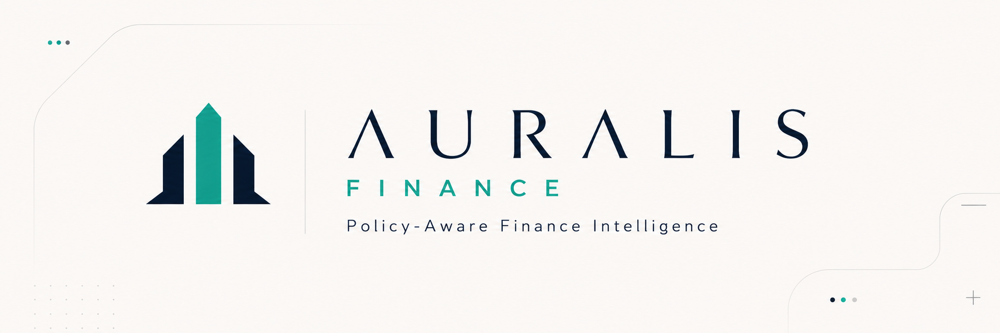

<div align="center">



# Auralis Finance

**The AI risk & compliance layer for tokenized real-world assets on Mantle.**

Auralis rates RWA / yield assets, screens wallets for eligibility, simulates policy-safe portfolio moves, and anchors every rating, attestation, and decision on-chain — so tokenized yield is safe to hold at size.

[Live site](https://auralisfinance.xyz) · [Judge Guide](docs/JUDGE_GUIDE.md) · [On-chain proof](docs/USDY_ONCHAIN_PROOF.md) · [Architecture](docs/ARCHITECTURE.md)

**Demo video:** _add link_ &nbsp;·&nbsp; **X / Twitter thread:** _add link_

</div>

---

## The problem

Tokenized real-world assets are growing fast, but the apps around them only show **yield**. What's missing is a credible, **verifiable trust layer**: how risky is this asset, am I even eligible to hold it, and can any of it be proven later? Auralis is that layer.

## What Auralis does

| Pillar | What it delivers |
|---|---|
| **Rate** | Deterministic, versioned **seven-dimension** Auralis Ratings (0–100 risk score + AAA–C grade) with AI-written, auditable explanations. |
| **Verify** | Wallet screening, per-asset-class eligibility verdicts by jurisdiction, exportable compliance reports, and reusable on-chain attestations. |
| **Manage** | An AI copilot **proposes**; seven deterministic guardrails **enforce**; the user **signs** every transaction. No autonomous execution, ever. |
| **Prove** | Ratings, attestations, decisions, and policy outcomes are committed to Mantle and re-readable as events — the Decisions ledger shows **only real chain data**. |

> Auralis provides risk information and compliance tooling, **not financial or legal advice**.

## Live on-chain proof (Mantle mainnet · chainId 5000)

The full USDY path was executed end-to-end with a **user-signed wallet** (not a deployer key). Full record + reproduction in **[docs/USDY_ONCHAIN_PROOF.md](docs/USDY_ONCHAIN_PROOF.md)**.

| Step | On-chain result | Transaction |
|---|---|---|
| `anchorRating(USDY)` | `verifyRating` → **MATCH** | [`0xce473b…d67cd4`](https://explorer.mantle.xyz/tx/0xce473bd6a99600ed78b296430a7d81aa14d22a933b32cd869b5ccc8204d67cd4) |
| `mintAttestation(US_TREASURY_RWA)` | `isEligible` → **ELIGIBLE** | [`0x1bda92…d4cb58`](https://explorer.mantle.xyz/tx/0x1bda92066304ec8aa7d433956652ac74e69c7ecd473e315a35b28fe668d4cb58) |
| `setPolicy` (USDY guardrails) | `checkRebalance` → **PASS** | [`0x4801a3…f29de9`](https://explorer.mantle.xyz/tx/0x4801a3d2b62ad8543f40d640d6258e9eb7b536733ab4398efe4eb51c6cf29de9) |
| `tryExecuteRebalance` | `RebalanceExecuted` emitted | [`0xd4882c…a8460d`](https://explorer.mantle.xyz/tx/0xd4882cd832e7d143aca413d74479154725ab0f11350b71c67323eddefea8460d) |

The Auralis rating and its AI-generated rationale hash, plus the compliance eligibility verdict, are committed on-chain via `anchorRating` and `mintAttestation` — the intelligence layer's output is written to Mantle as a verifiable proof

## Deployed contracts

Production deployment on **Mantle Mainnet · chainId 5000**.

| Contract | Address | Explorer | Sourcify |
|---|---|---|---|
| `AuralisAgentRegistry` | `0x2939Df04CAfcd310f764d928559f2BF9F284a2f4` | [Explorer](https://explorer.mantle.xyz/address/0x2939Df04CAfcd310f764d928559f2BF9F284a2f4) | [Full match](https://repo.sourcify.dev/contracts/full_match/5000/0x2939Df04CAfcd310f764d928559f2BF9F284a2f4/) |
| `AuralisRatingRegistry` | `0xF59c877C83E6519A606810b4d8DA52Ccf34d5A22` | [Explorer](https://explorer.mantle.xyz/address/0xF59c877C83E6519A606810b4d8DA52Ccf34d5A22) | [Full match](https://repo.sourcify.dev/contracts/full_match/5000/0xF59c877C83E6519A606810b4d8DA52Ccf34d5A22/) |
| `AuralisComplianceAttestor` | `0xe4eE2b0984FF9F604bF03d0521808037Ea5d3b34` | [Explorer](https://explorer.mantle.xyz/address/0xe4eE2b0984FF9F604bF03d0521808037Ea5d3b34) | [Full match](https://repo.sourcify.dev/contracts/full_match/5000/0xe4eE2b0984FF9F604bF03d0521808037Ea5d3b34/) |
| `AuralisPolicyGuard` | `0xFaD41c7d7e777853CF7aC04641Df0D88B27A7b0E` | [Explorer](https://explorer.mantle.xyz/address/0xFaD41c7d7e777853CF7aC04641Df0D88B27A7b0E) | [Full match](https://repo.sourcify.dev/contracts/full_match/5000/0xFaD41c7d7e777853CF7aC04641Df0D88B27A7b0E/) |

Deployment metadata: `packages/contracts/deployments/mantle.json`.

## How it works

```
        ┌── Adapters ──┐     ┌──── Core engines (deterministic) ────┐
Mantle / RWA data ───▶ normalize ─▶ rate · classify · screen · policy ─┐
                                                                       │
                              ┌── AI layer (ELFA + OpenAI) ──┐         ▼
                              │ explanations · copilot       │   keccak proof
                              └──────────────┬───────────────┘   (stable JSON)
                                             ▼                         │
   Next.js app (marketing + product)  ◀── Supabase persistence ◀───────┤
        │  wallet signs (wagmi)                                        │
        ▼                                                              ▼
   AuralisRatingRegistry · ComplianceAttestor · PolicyGuard · AgentRegistry  → Mantle
```

- **Deterministic core** produces the same rating / report / policy result every time; the AI layer only *explains* and *assists* — it never decides or signs.
- **Proofs** are `keccak256` of canonical (stable-sorted) JSON, anchored on-chain and re-verifiable.
- **Non-custodial**: no server signing key; every state-changing action is signed by the user's wallet.

## Product surfaces

**Public (marketing):** `/` · `/product` · `/ratings` · `/ratings/[assetId]` · `/methodology` · `/security` · `/business` · `/company` · `/docs` · `/faq`

**App:** `/app` (5-step onboarding) · `/app/dashboard` · `/app/opportunities` · `/app/opportunities/[assetId]` · `/app/compliance` · `/app/simulator` · `/app/copilot` · `/app/policies` · `/app/decisions` · `/app/agent` · `/app/integrations` · `/app/settings`

Ratings for USDY are anchored on-chain; the other assets are clearly labelled **off-chain preview**. Full light/dark theming, motion (reduced-motion aware), and skeleton/retry loading states throughout.

## Tech stack

- **Web:** Next.js 15 (App Router) · React 18 · TypeScript · Tailwind CSS 3 · Framer Motion 12
- **Chain:** Mantle mainnet · wagmi 2 · viem 2 · Solidity (Hardhat, Sourcify-verified)
- **AI:** ELFA (primary inference, server-side only) + OpenAI · deterministic prompt/response hashing + cache
- **Data:** Supabase (Postgres) for users, ratings, attestations, compliance reports, decisions, policies
- **Monorepo:** pnpm + Turborepo

```text
apps/web             Next.js marketing + product app
packages/contracts   Hardhat contracts, deployments, verification
packages/core        deterministic rating / compliance / policy engines
packages/adapters    normalized Mantle / RWA data adapters
packages/types       shared Zod schemas
packages/ui          shared Auralis UI primitives
docs                 architecture, methodology, judge & submission docs
```

## Quickstart

```bash
pnpm install
cp .env.example .env.local        # fill in the values below
pnpm -F @auralis/web dev          # http://localhost:3000
```

Required environment (see `.env.example`):

- `NEXT_PUBLIC_MANTLE_RPC_URL`, contract addresses (safe defaults baked in)
- `SUPABASE_URL`, `SUPABASE_SERVICE_ROLE_KEY`, `NEXT_PUBLIC_SUPABASE_ANON_KEY`
- `ELFA_API_KEY` (**server-side only — never `NEXT_PUBLIC_`**), `OPENAI_API_KEY`
- `NEXT_PUBLIC_APP_URL` (used for absolute OG/Twitter image URLs)

**Database:** apply `supabase/migrations/0001_init.sql` to your Supabase project once (creates `users`, `ratings`, `attestations`, `compliance_reports`, `decisions`, `policies`, `ai_cache`). Without it, onboarding can't persist state.

## Verification

```text
@auralis/core test          19/19 passing (vitest)
@auralis/core typecheck      clean
@auralis/web typecheck       clean
@auralis/web build           42 static pages generated; optional vendor warnings only
route smoke (prod build)     22/22 routes return 200
USDY flow                    4 real user-signed txs on Mantle mainnet (see proof doc)
Sourcify                     all four mainnet contracts: full match
```

## Documentation

- [Judge Guide](docs/JUDGE_GUIDE.md) — 5- and 15-minute judging paths
- [USDY On-chain Proof](docs/USDY_ONCHAIN_PROOF.md) — live tx hashes + reproduction
- [Tutorial](docs/TUTORIAL.md) — USDY closed-loop walkthrough
- [Architecture](docs/ARCHITECTURE.md) · [Risk Methodology](docs/RISK_METHODOLOGY.md) · [Compliance Framework](docs/COMPLIANCE_FRAMEWORK.md)
- [Contracts](docs/CONTRACTS.md) · [API](docs/API.md) · [Security](docs/SECURITY.md)
- [Business Model](docs/BUSINESS_MODEL.md) · [Pitch](docs/PITCH.md) · [Submission Checklist](docs/SUBMISSION_CHECKLIST.md)

## Submission links

- **Live demo:** https://auralisfinance.xyz
- **Demo video:** _add link_
- **X / Twitter thread:** _add link_
- **Network:** Mantle mainnet (chainId 5000)

## 中文摘要

Auralis Finance 是 Mantle 上代币化真实世界资产（RWA）的 **AI 风险与合规层**。它用确定性的七维模型为资产生成可解释评级，筛查钱包合规资格，在七项硬性护栏下模拟受策略保护的投资组合操作（AI 只建议、用户签名执行），并将评级、合规证明与决策哈希写入 Mantle 主网，形成可验证的链上证明。USDY 全流程已在主网用用户签名完成真实交易（见 `docs/USDY_ONCHAIN_PROOF.md`）。

---

<div align="center">
Built on Mantle · Auralis provides risk information, not financial or legal advice.
</div>
